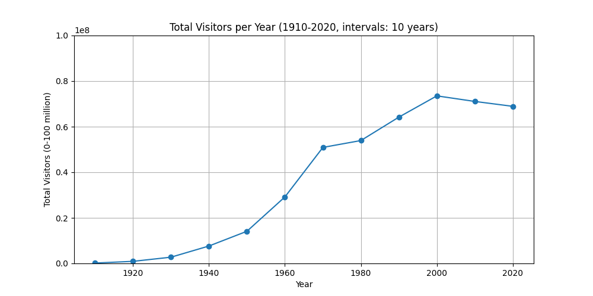
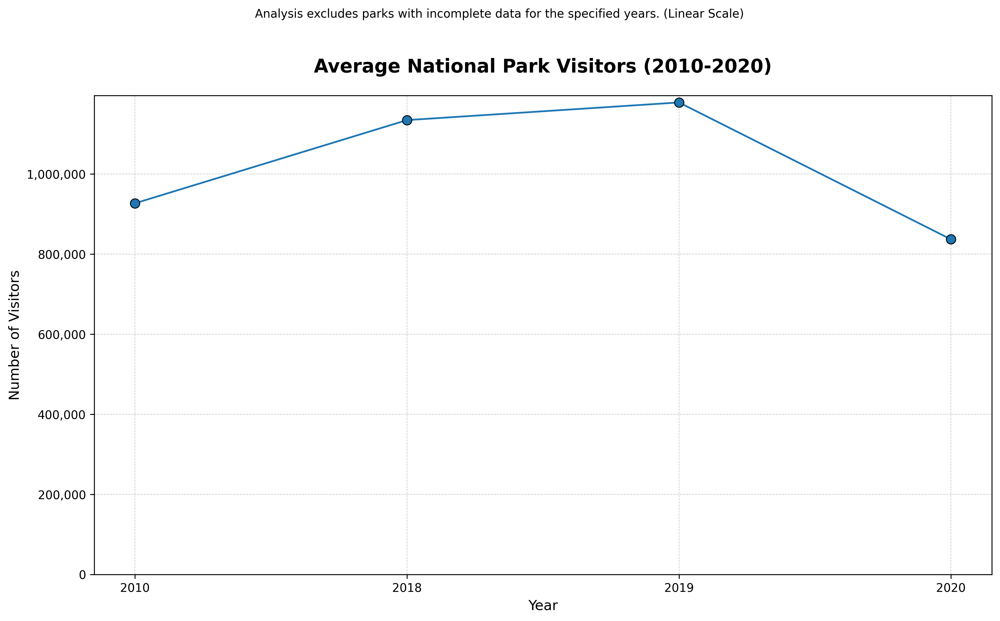

# info25final

## Main Idea
We will be takeing data from each park about how many visitors each park has gotten over the years. We will use this data to show which parks are the most popular, which parks are the least popular, as well as showing the effect that covid had on national park visitors. We will use the location of each parks, and the size of each park to compare how size and location effect visitors.

## Data
Our data consists of the name of the national park, the coordinates, the number of visitors per certain years, and the ID. Our cleaned data has gotten rid of parks that are missing any of these pieces of data. Our number of visitors was origonally flaots, so we made them into integers to make them easier to work with. We also made sure the parks had the same amount of years availible for the visitor count.

## Visuals
Individual Park Visitors Bar Plot

These three plots show the total number of visitors at individual National Parks/Reserves in one year. When saving these images, the names of the National Parks are cut off which renders them basically unreadable. Because the same parks didn't report their visitor numbers in all three years, I was unable to code an order for the parks to appear on the x-axis. For these two reasons, these plots were left out of the final presentation, until McKenna (me) accidentally got stuck on them during the question period. 
These plots do have some interesting information. Many parks had very little change in their visitor numbers between 2019 and 2020. Black Canyon of the Gunnison, Crater Lake National Park, Everglades National Park, Bryce Canyon, and Dry Tortugas National Park, all had noteably more visitors in 2020 than 2019. Conagree National Park, Capitol Reef National Park, Carlsbad Caverns National Park, Glacier Bay National Park and Preserve, and Biscayne National Park all had noteably fewer visitors in 2020 than 2021. In 2021, the visitor count for Cuyahoga Valley National Park, which had been somewhat constant between 2019-2020, skyrocketed along with the Everglades National Park attendence. 
Further investigation into the conditions of each park in each year and the visitor count for each park in each year would be needed to determine if the COVID-19 pandemic caused lower/higher visitor attendence to each National Park. 

The above graph shows the total number of visitors to each park every 10 years. This is able to show us the progerssion of visitors through-out the years. It also is great to show the differece in growth rate from the 1910-2020.

This plot shows a focused look at the parks (those with available data for all the years shown) and the changes from the preceding years to 2020. It averaged all these parks visitor counts over the year to show a general trend over time for parks across the nation.

## API

## Conclusion
In conclusion, the US National Parks did experience a decline in total number of visitors during the 2020 pandemic. This phenomenon was not equally distributed across all parks, though, as some experienced a growth in popularity during the pandemic. THe US mainland National Parks were the only ones to grow in popularity, likley because air travel was limited during the pandemic. The data used for this project does not have sufficient data to determine if the lockdown was the cause of the observed changes in visitor numbers. The main limitation to our analysis is that only 16 of 60+ parks recorded visitor population for 2019, and fewer recorded visitor counts in 2020 and 2021. A year-by-year account of each National Park, their specific type of recreation and their accessibility to visitors in terms of travel and recreation level would be needed in order to make this conclusion. 
